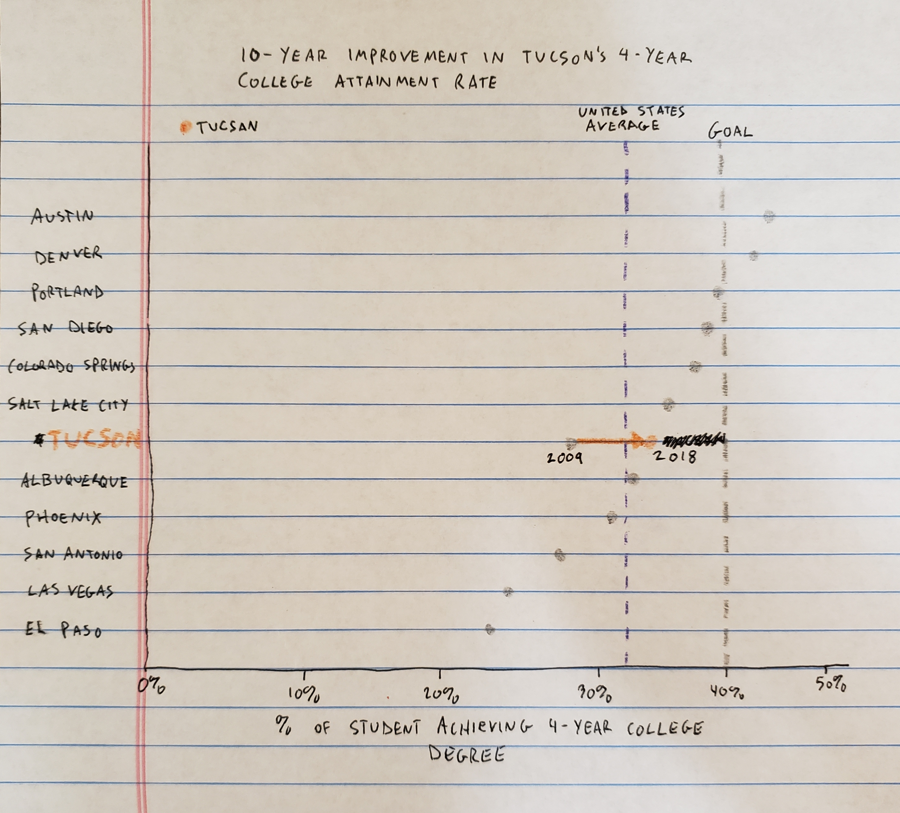

# Original Visualization

# Process
When orinigally looking at this chart, I found it very difficult to visualize all of the key data at a glance.  Using Stephen Few's Data Visualization Effectiveness Profile, I rated the visualization for Usefulness, Completeness, Perceptibility, Truthfulness, Intuitiveness, Aecthetics, and Engagement.  Some of the things I liked about the chart were that it is aesthetically pleasing, clearly highlights Tucson as the city of emphasis, and it is clearly visible that Tucson is ahead of the U.S. Average.  Although I thought the chart was aesthetically pleasing, I do not think it is the best way to present this data, especially when considering the target audience.  The alternating colors of the percentages around the dial are distracting, the varying sizes of the different spokes within the dial don't mean anything, the range of 22.0% to 44.0% seems arbitrary and could easily be manipulated to make Tucson look better or worse, and finally, Tucson's 10-year improvement in Four-Year College Attainment Rate fades into the background when it is one of the most important aspects of this visualization.

My next steps were to try and think about how to improve upon this chart.  I decided that highlighting Tucson and Tucson only was important, as that is the key data point in this visualization.  Additionally, I wanted to make sure that the 10-year improvement jumped off the page, because a nearly 3% improvement in Four-Year College Attainment Rate is impressive and needs to be called out.  In thinking how to compare these data points against each other in a way that is clearly visible and also being able to show a change in percentage over time, I thought that a dumbell chart would be a good chart to visualize this.

I created a rough sketch of what the chart would look like and sent it to 2 people to review.  I selected one person in my target audience (an Arizona school teacher) and one person who has experience with data visualizations (former manager of data analysts).  I thought that the mix of these 2 perspectives would help to create a chart that is polished and understandable by the people that really need to understand it.

# Original Wireframe

# Feedback
**Friend #1, Arizona school teacher:**

Can you tell me what you think this is?
* to show the percentage growth of students achieving a 4-year college degree compared to other western US cities

Can you describe to me what this is telling you?
* in 2009, less than 30% of Tucson students were achieving a 4-year college degree. In 2018, this increased about 5-7% and exceeded the US average rate

Is there anything you find surprising or confusing?
* it’s surprising that most cities are below the US  goal. Is the goal for every city or just Tucson?

Who do you think the audience is for this?
* (Not answered)

Is there anything you would change or do differently?
* I liked it!!! Sooo cute! I would add labels for the Tucson percentages and add that the other cities are regional

**Friend #2, Manager of Data Analysts:**

Can you tell me what you think this is?
* not sure if it's a chart of high school students getting into a 4 year college or students who started college and ending up after 4 years getting a degree

Can you describe to me what this is telling you?
* that over the 10 year period Tuscon improved by about 5 percent

Is there anything you find surprising or confusing?
* not sure whether the line for the goal is just for Tuscon or not.  Do other school districts  have other goals--I assume so
* is this students who got into a 4 year college or students who got in and actually matriculated and went to a 4 year program?
* not sure if this is for public schools or public/private schools in Tuscon

Who do you think the audience is for this?
* Tucson school department heads

Is there anything you would change or do differently?
* define attainment rate in a legend

# Final Redesign

<noscript></noscript><object class='tableauViz'  style='display:none;'><param name='host_url' value='https%3A%2F%2Fpublic.tableau.com%2F' /> <param name='embed_code_version' value='3' /> <param name='site_root' value='' /><param name='name' value='high_school_college_critique&#47;Sheet1' /><param name='tabs' value='no' /><param name='toolbar' value='yes' /><param name='static_image' value='https:&#47;&#47;public.tableau.com&#47;static&#47;images&#47;hi&#47;high_school_college_critique&#47;Sheet1&#47;1.png' /> <param name='animate_transition' value='yes' /><param name='display_static_image' value='yes' /><param name='display_spinner' value='yes' /><param name='display_overlay' value='yes' /><param name='display_count' value='yes' /><param name='language' value='en' /></object>

In my final redesign, I tried to address all of the issues raised from my friends' feedback.  I defined Four-Year College Attainment Rate differently, I labeled the 2 Tucson data points, and made it clear that the goal line was for Tucson.  I think that this chart is much easier to read and understand compared to the initial dial chart.  At a glance, you can see that Tucson has gone from below to above the US Average over the past 10 years, which is the most important information we are trying to get across.
